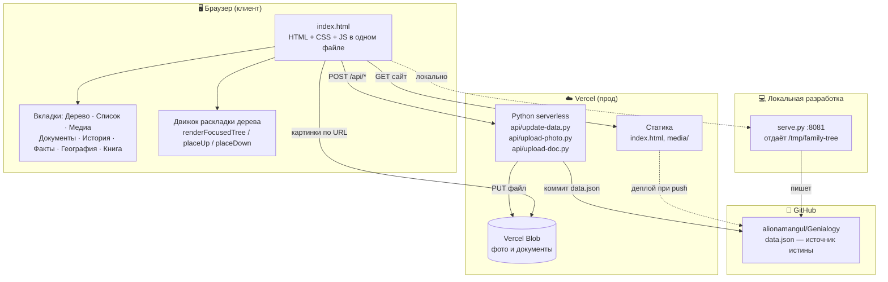
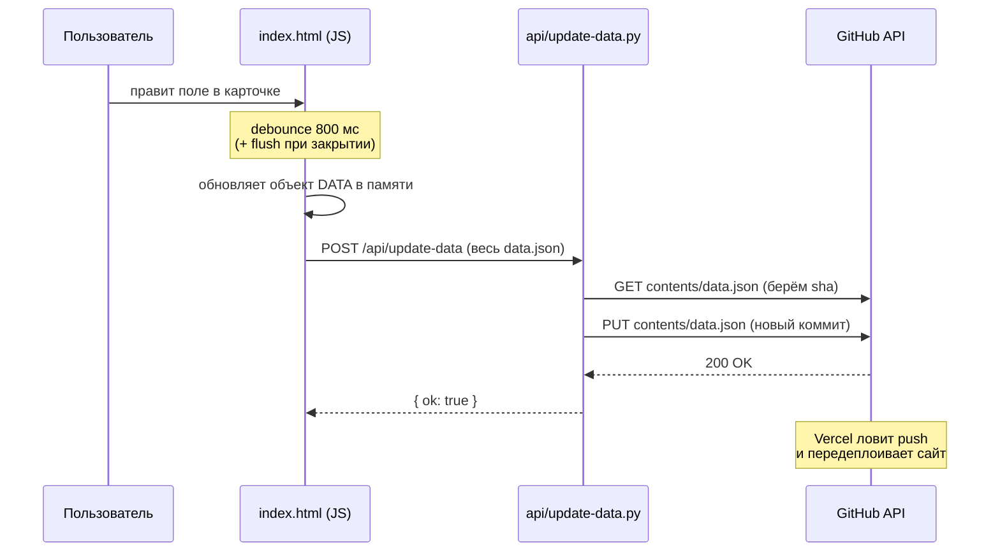
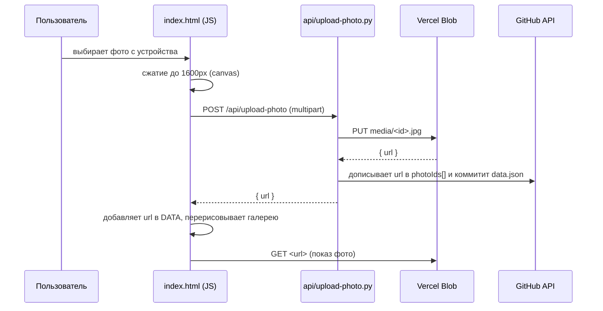
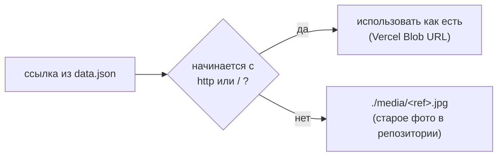

# Архитектура

> Как устроен проект технически. Схемы в формате Mermaid — GitHub рендерит их автоматически.
> Последнее обновление: 2026-06-20

## Обзор

Проект — статический фронтенд (один HTML-файл) плюс тонкий бэкенд из serverless-функций.
Никакой базы данных: источник истины — файл `data.json` в репозитории, медиа — в Vercel Blob.

## Компоненты системы



## Поток: сохранение карточки человека



## Поток: загрузка фотографии



## Логика выбора пути к медиа



Реализовано хелперами `photoUrl()` и `docUrl()` в `index.html`. Благодаря этому старые
фото (числовые id) и новые (полные URL) работают одновременно без миграции данных.

## Движок раскладки дерева

Самая сложная часть `index.html` — расчёт координат узлов. Конвейер:

```
renderFocusedTree
  ├─ getAncestorChain / walkAncestors   — собрать видимых предков обеих ветвей
  ├─ assignGenerations                  — пронумеровать поколения
  ├─ placeDown                          — разместить потомков сверху вниз
  ├─ placeUp                            — разместить предков снизу вверх (с guard от рекурсии)
  ├─ resolveRowOverlaps / resolveOverlaps — развести пересечения, пары как единое целое
  ├─ Step F / Step G                    — финальное центрирование родителей над детьми
  └─ нормализация + центрирование верхнего ряда
```

Ключевые константы: `NODE_W=100`, `NODE_H=90`, `SPOUSE_GAP=8`, `H_GAP=20`, `V_GAP=80`.

> Известная проблема раскладки (предки не строго над ребёнком при конфликте веток)
> описана в [BACKLOG.md](BACKLOG.md).

## Конфигурация окружения (Vercel)

| Переменная | Назначение | Откуда |
|---|---|---|
| `GITHUB_TOKEN` | запись `data.json` в репозиторий | GitHub → Settings → Tokens (scope `repo`) |
| `BLOB_READ_WRITE_TOKEN` | загрузка медиа в Blob | добавляется при подключении Vercel Blob |

## Почему так (ключевые решения)

- **Один HTML-файл** — простота: нет сборки, можно открыть и отредактировать что угодно.
- **`data.json` в git вместо БД** — версионирование «бесплатно», вся история правок в коммитах.
- **Vercel Blob для медиа** — git не предназначен для бинарников; Blob отдаёт через CDN.
- **GitHub API для записи** — прод не имеет файловой системы для постоянного хранения,
  поэтому данные коммитятся обратно в репозиторий.
